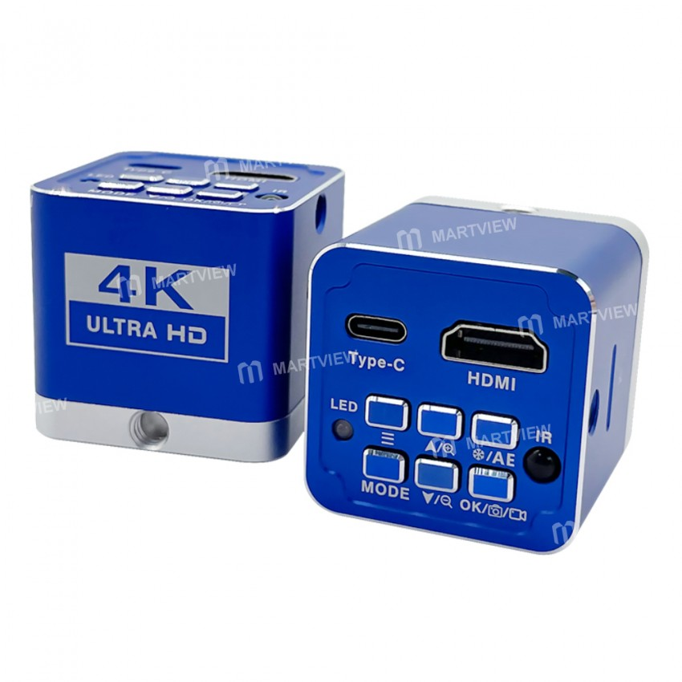
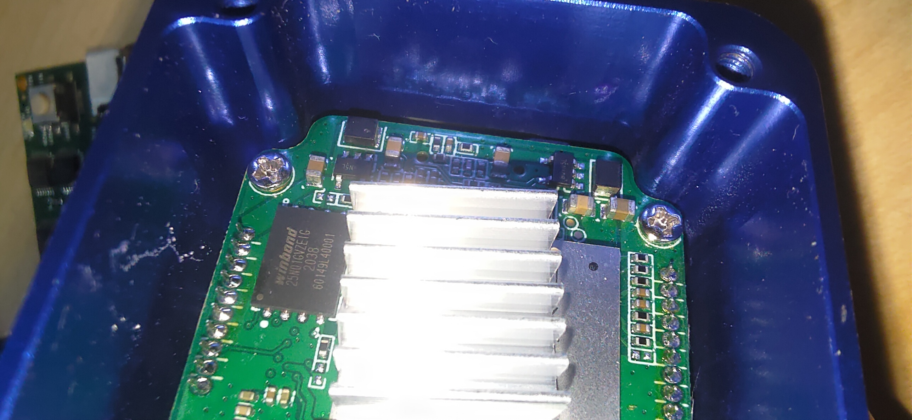
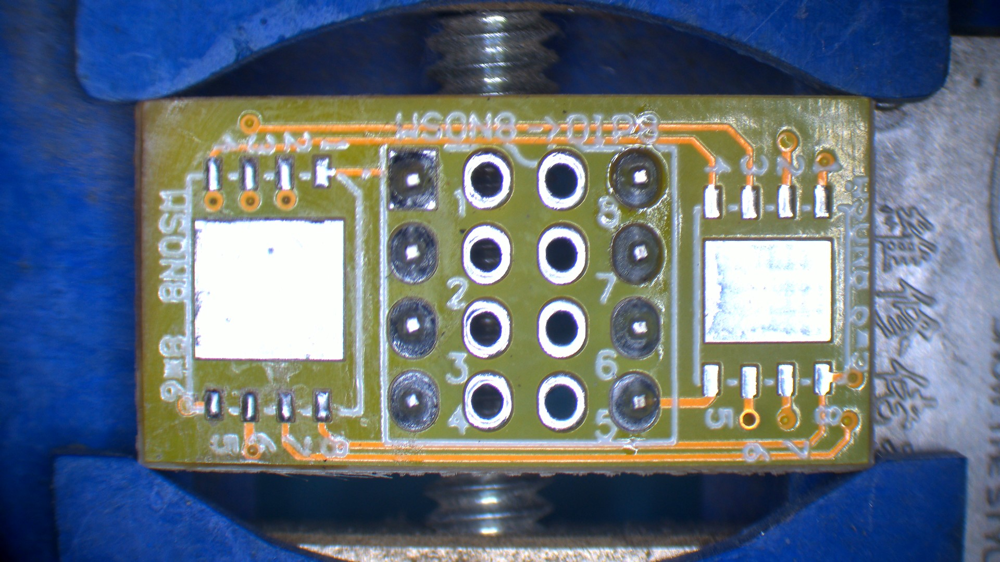
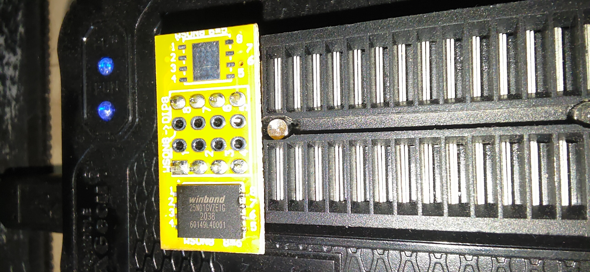

# SQTD-B39-4K-Trinocular-Microscope-Camera-Firmware-Dump
SQTD-B39 4K Trinocular Microscope Camera Firmware Dump

Hi, in this repository, I will dump the flash memory for the SQTD-B39 microscope in case of firmware failure.

# Microscope image

  

# Photo for the flash memory

  

# Dumping Process
From the image above. We got the flash memory information:
* Part Number: W25N01GVZEIG
* Type: NAND FLASH.
* SIZE: 1 Gbit.
* Voltage: 3 V.

I have used the XGCEU T48 with the WSON-8-to-DIP-8 socket. Please kindly note that the flash memory

Socket Used:

  

The following picture shows the socket connected to the programmer.

  

Dumping Process:

  

# Dumped files
Kindly see the folder [Dump](./Dump).